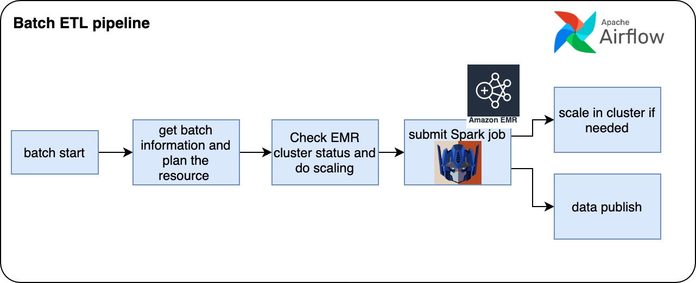
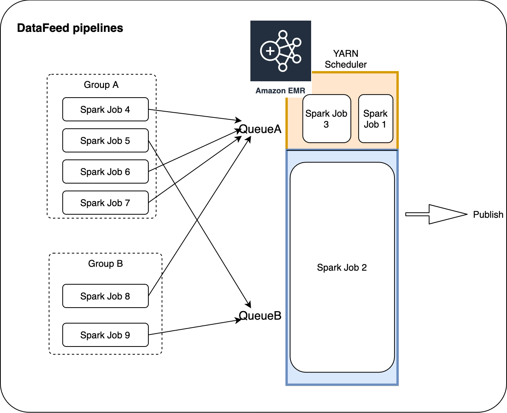
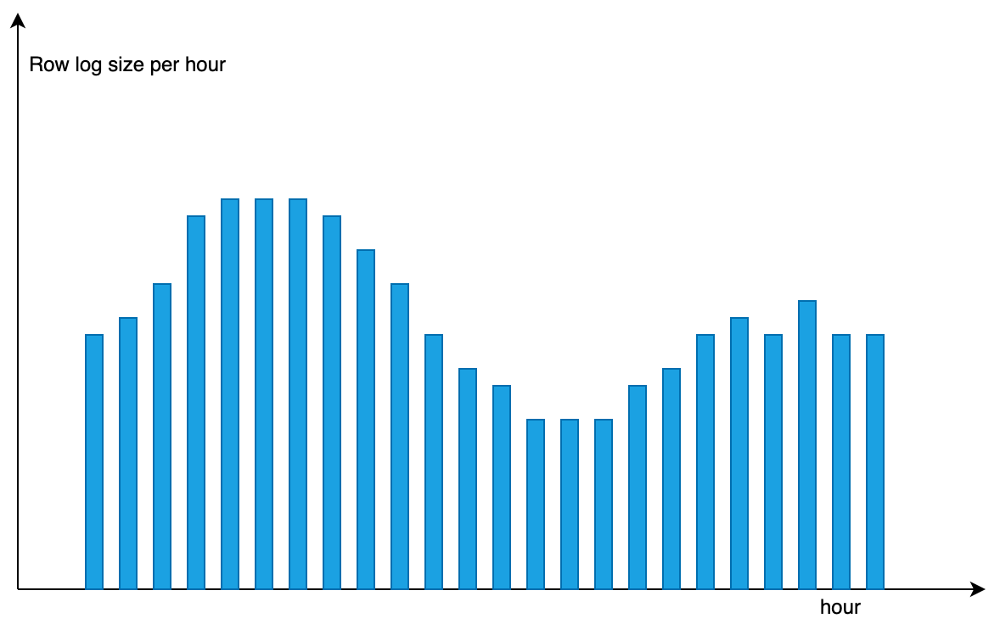
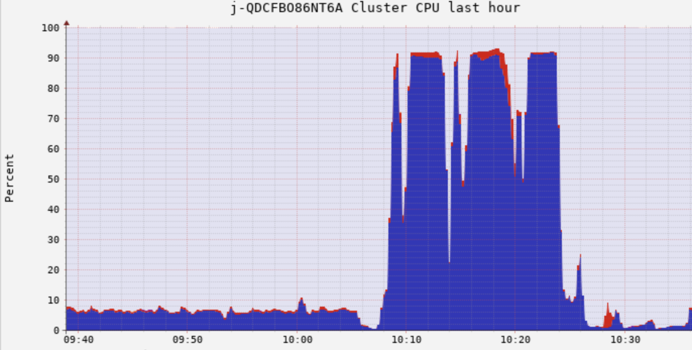
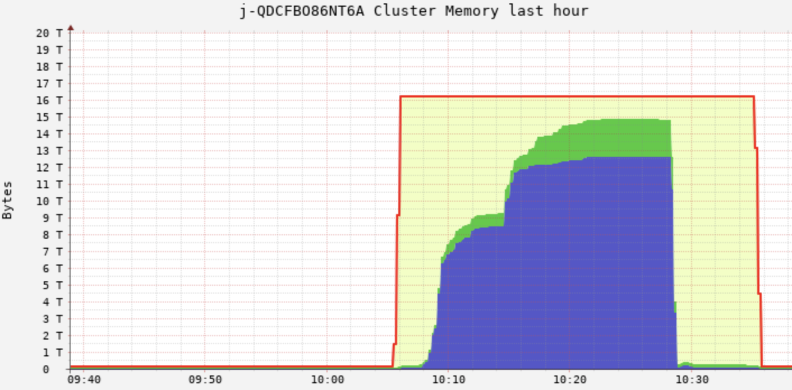
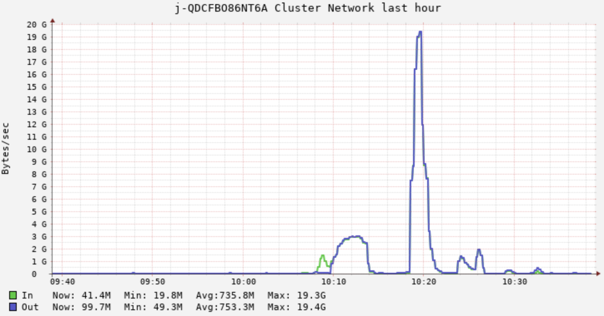
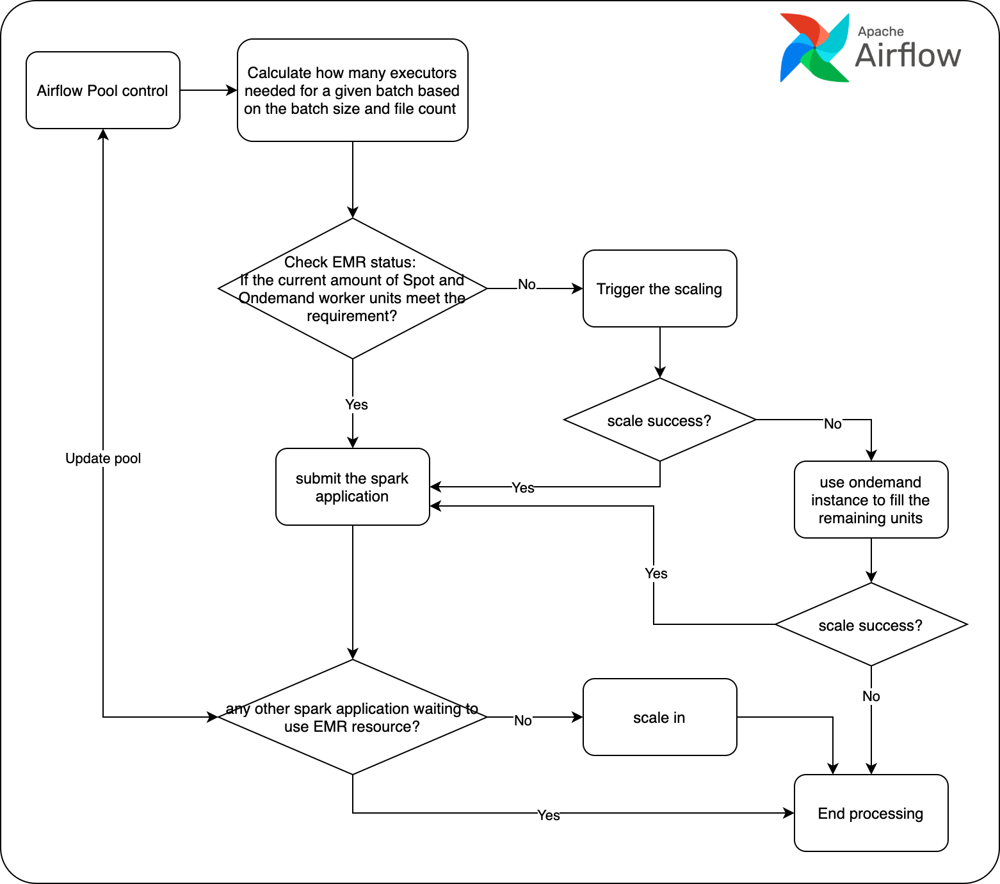
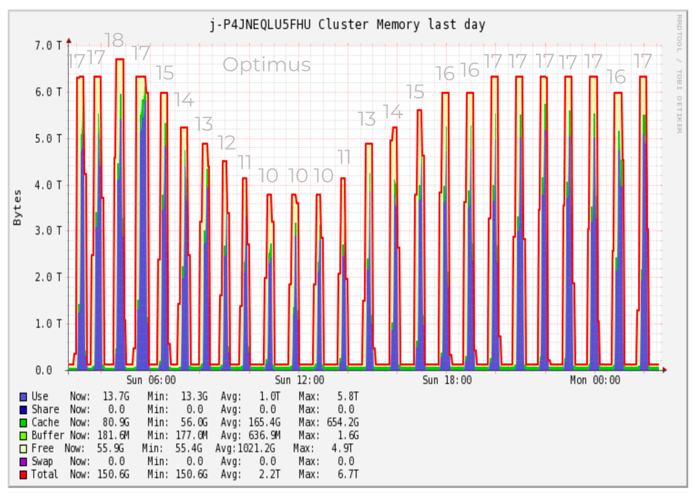
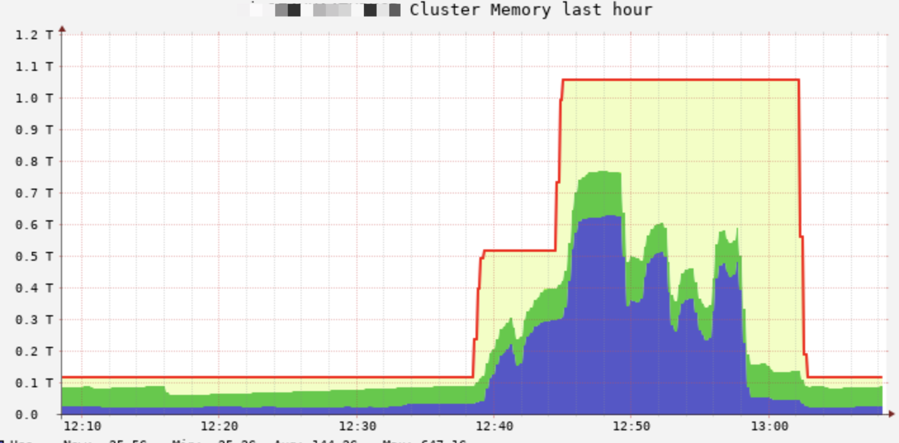

# AWS EMR在FreeWheel的应用与实践  

AWS Elastic MapReduce(EMR)是Amazon提供的托管集群平台，用户可以非常方便的使用EMR搭建起一套集群，用来支撑大数据框架的应用，如Apache Spark， Hive， Flink， Presto等等。因为EMR具有很好的可配置性和伸缩性，使用者可以灵活的根据自己的需求进行定制，在满足生产需求的同时，减低对基础设施的运维成本。  
FreeWheel大数据团队在搭建数据仓库的过程中，在EMR的使用上积累了大量的实践和运维经验，本文将从EMR实践的角度出发，讲述FreeWheel Transformer团队在搭建ETL pipeline的过程中是如何玩转EMR的，以期抛砖引玉。  


## 一个典型的Spark on EMR上集群架构概览 
我们先来了解一下一个典型的AWS EMR集群是什么样子的。EMR默认使用了Yarn来管理集群资源。EMR将node分为了Master， Core和Worker三个组（通过Yarn label实现）。  
  

### 主节点（Master node）
EMR的Master node用来管理整个集群，集群至少要有一个Master node（从EMR-5.23开始，如果需要Master node HA，可以选择实例计数为3，此时根据不同的应用，会有不同的HA方案）。  

以运行Hadoop HDFS和Yarn为例，Master上会运行Yarn ResourceManger和HDFS NameNode。在高可用方案下，Yarn ResourceManager会在所有三个主节点上运行，并采用Active/Standby模式进行工作。如果ResourceManager的主节点发生故障，EMR将启动自动故障转移过程，具有Standby ResourceManager的Master node将接管所有操作，可以通过 `yarn rmadmin -getAllServiceState` 来获取当前服务状态。关于Yarn ResourceManger HA的具体细节，可以参考[ResourceManager HA](https://hadoop.apache.org/docs/current/hadoop-yarn/hadoop-yarn-site/ResourceManagerHA.html)。  
与ResourceManager类似，NodeManager会在三个主节点中的两个节点上运行，分别处于Active和Standby状态。如果Active NameNode的主节点发生故障，EMR会将启动HDFS故障转移过程。此时 Standby状态的NameNode将变为Active并接管集群中的所有对HDFS的操作。我们可以通过`hdfs haadmin -getAllServiceState`命令来获取当前NameNode状态。关于HDFS HA的具体细节，可以参考 [HDFS HA](https://hadoop.apache.org/docs/stable/hadoop-project-dist/hadoop-hdfs/HDFSHighAvailabilityWithNFS.html)。  

### 核心节点（Core node）
Core node为可选组，其上运行了HDFS DataNode。当Core node个数少于4时，EMR默认会将HDFS的replica设置为1，Core node少于10个时replica为2，其余情况为3。 如果需要进行自定义设置，可以修改启动EMR对hdfs-site.xml中dfs.replication的配置；**这里要注意一点，如果我们在一个已经启动的EMR中，在对Core node进行伸缩的时候，会影响到HDFS数据的re-balance，这是一个耗时的操作，不建议频繁做Core node的scaling。**而且对于replica是3的集群，如果将core node的个数缩减为少于3个的话，也将无法成功。  

### 工作节点（Worker node）
Worker node为普通的工作节点。非常适合作为单纯的工作节点应对工作负载需要频繁伸缩的场景，其上运行了NodeManager，在其启动之后，会加入到Yarn的集群管理之中。对于需要频繁scale的场景，仅仅scale Worker node是一个比较实际的方案，效率比较高。

### 任务队列（InstanceFleet）
Core node和Worker node都可以配置实例队列，实例队列是一个非常实用的功能，尤其是在Spot实例的场景，在一些热门事件发生时，一些热门机型的中断率会变得很高，如果选择单一类型实例的话，很容易出现无法满足需求，我们可以在[spot advisor](https://aws.amazon.com/cn/ec2/spot/instance-advisor/)上查看当前的实例中断情况。后面章节我会详细描述我们是如何使用实例队列的。  

### EMR版本
在创建EMR时，需要额外注意EMR的release版本，不同版本支持的应用版本也不同。 从EMR-6.1.0版本起，已经开始支持Spark3.0.0 + Hadoop 3.2.1的组合了，目前最新的EMR-6.2.0版本，已经可以支持稳定版本的Spark3.0.1了。如果需要运行Spark2.x版本，可以选择EMR-5.x版本或者EMR-6.0.0。  
除应用版本区别，从EMR-6.0.0起，系统基于Amazon Linux 2和Corretto JDK 8构建，相对于以往的Amazon Linux 1 最大的区别是提供了新的系统工具，如Systemctl，以及优化的Amazon linux LTS内核。另外Amazon Corretto JDK 8提供经过 Java SE 认证的兼容 JDK，包括长期支持、性能增强和安全修复程序。 关于emr-6.x的release note，可以参考[EMR release note](https://docs.aws.amazon.com/emr/latest/ReleaseGuide/emr-release-6x.html)。  
另外，AWS最新已经支持EMR on EKS， 我们可以更灵活的将EMR创建在EKS中，以期更灵活使用和更低的费用，目前这一块我们团队正在调研和adoption，我会在和后续的文章中专门来聊这一块。  

## EMR在FreeWheel批处理ETL pipeline中的实践   
在批处理ETL pipeline中有两个重要的组件分别叫Optimus和JetFire，就是大家耳熟能详的擎天柱和天火，是由贵司Transformer team建立的一套基于Spark的数据建模和处理框架（所以贵team的产品都以Transformer中的角色来命名）。Optimus主要针对的是数据仓库层的建设，主要功能是将广告系统产生的log经前端模块收集起来后，根据商业逻辑的需求进行抽取转换，统一建模，并做了大量业务的enrichment，将原始数据转换成方便下游应用端进行分析使用的Context Data，最终由Spark SQL生成宽表落盘。JetFire更偏向于一个灵活通用的基于Spark的ETL Framework，能让用户更简单方便的将基于宽表之上的数据加工需求进行快速实现。这些pipelines都是由Airflow进行任务的编排和调度。  



### 任务特点 

#### 基于Optimus的批处理ETL pipeline
- ETL pipeline每小时一个batch，由于客户分布在全球各个时区，所以数据的发布需求是按照客户所在时区的零点之后发布当前时区客户前24小时的数据；另外有些产品也需要支持每个小时的数据都不能延迟，每个小时的数据处理需要控制在30min以内； 
- 数据量不稳定；客户在不同时区分布的密度，各个小时的流量也不同，以及区域性事件的发生，以及内部上游模块可能会发生delay等都会造成每小时数据量不均匀。虽然每天24个小时的数据量分布虽然大致趋势相同，但是不能准确预测，只有将要开始处理这个batch的时候，才能从上游拿到这个batch的数据量信息；
 
- 数据在ETL的中间过程中在HDFS上没有持久化需求；对于HDFS的需求是支撑Spark任务以及EMR集群的访问，保证一次批任务内部的事务性即可。需要持久化的数据会由后续的模块load到clickhouse，以及同步发布到S3上交由hive来管理；
- Spark任务对于集群资源的需求：Optimus中由于存在大量的计算（如数据序列化反序列化，metric的计算，数据的排序聚合，Hyperloglog计算等）和缓存（分层建模中，在DAG中被反复用到的数据），Spark任务在不同阶段对集群资源的需求点是不同的：从数据load进内存到对数据进行transform进行建模的过程，是计算密集型的，需要消耗大量的CPU，同时由于有些dataframe需要被更上层的模型复用，需要cache起来，这里需要大量的memory； 而最终在支撑大量并发SparkSQL的数据抽取和聚合的运算中，网络和CPU都是很大性能瓶颈。我们针对Spark应用做了非常精细的调优工作，具体可以参考这些文章[placeholdes for article links](???)。在处理一个batch的过程中，集群资源使用情况可以对应比较下面三个图。
  

#### 基于JetFire的DataFeed pipeline
- Datafeed中的任务具有不同的schedule，不同的input数据量，提交到EMR集群的任务负载无法提前预知。这种场景下，EMR更像是一个共享的计算平台，我们很难从单独一个应用的角度对整体资源进行规划。
- 考虑到基于Optimus的ETL pipeline是众多下游应用的共同依赖，需要保证很高的稳定性，我们期望能够在独占一个EMR集群的前提下尽量降低开销。而Datafeed pipeline任务零碎且多，绝大部分任务轻量需要较快完成。

### 我们来各个击破上述需求

#### EMR集群配置
基于前文对EMR集群的介绍以及实际应用需求，总的来说，我们使用了在Long term的EMR集群，运行单点Ondemand机型的Master node + 单点Ondemand机型的Core node + 动态伸缩的由Spot&Ondemand机型的InstanceFleet组成的Worker。  

##### Long term EMR VS Ondemand创建EMR
我们不选择在每次需要EMR集群的时候去重新创建一个集群的原因是，除了机器实例provision的时间外，EMR还需要额外运行较长时间的bootstraping脚本去启动很多服务才能让整个集群ready。而Master node和Core node我们在上文介绍过，相较于Worker node，他们不仅需要支撑Hadoop服务，还需要下载并配置Spark， Ganglia等环境，以及更多服务（根据用户勾选的application决定），这样频繁创建和销毁带来的时间开销相对于hourly schedule的任务而言，是不能忽略的。所以我们选择创建维护一个long term EMR集群，通过scale worker node来控制负载的方案。而对于使用间隔较长，如daily甚至weekly job 来讲，在每次需要使用EMR的时候进行临时创建是一个更合理的方案。  
选择Long term之后我们就需要关注集群的稳定性，然而我们仍然选择了没有HA的方案，由于Master和Core均为Ondemand机型，这样就可以保证集群在非极端特殊情况下不会出现crash的情况。而对于极端特殊情况，考虑到两个pipeline对数据持久化并无需求，如果能在分钟级别的时间内重建EMR集群并恢复任务，相对于长期存在的HA方案的master + core方案来说，在都能满足生产需求的情况下ROI更高。所以综合考虑，我们选择了单点master和单点core node的方案，配合上Terraform脚本和Airflow的调度，我们可以在发生小概率集群事故得到情况下快速重建EMR集群并重跑任务，从而恢复pipeline。  
额外值得一提的是，在EMR使用初期，Terraform上并不支持创建具有InstanceFleet的EMR，当时仅能够使用命令行或者使用boto3的库创建一个EMR集群，由于没有state文件进行track，所以也无法通过Terraform进行统一管理（如销毁和修改等），针对EMR这部分只能自己实现一套stateful的管理脚本。目前最新版本得到Terraform已经加入了对带有InstanceFleet的EMR的支持。但是实际使用当中，由于EMR中的很多配置只能在创建时一次性修改，如Master&Core&Task的机型配置，InstanceFleet的机型选择，Hadoop和Spark的一些customize的配置（这个依然可以通过启动之后修改对应的xml或者conf文件，然后重启对应服务进行修改，但是这种做法对于产品环境并不友好），Security group等，如果需要修改这些，仍然需要销毁集群，用新的配置重新创建。  

##### 关于Spot机型和AZ的选择
考虑到成本，我们会优先使用Spot机型作为Worker，使用Ondemand机型做补充。Spot机型在资源紧俏的情况下有可能申请不到，即使申请到也有可能会出现中断被收回的情况，我们会在创建EMR时将AZ设置为多个，以增加成功申请到机器的概率。不过多AZ的配置仅在创建EMR时生效，EMR会选择 **创建时** 资源较为宽裕的AZ申请instances，而在EMR创建好之后，就只能在一个固定的AZ中使用了，后续即使这个AZ机器资源紧俏而其他可选的AZ资源充裕，由于集群Master和Core已经在当前AZ存在，不能再到其他AZ申请机器。考虑到Spark集群通信开销，跨AZ带来对性能的影响不能忽略，这种设计也是很合理的。因此，多AZ的设置对于每次需要重新创建EMR的场景是一个非常有用的功能，而对于long term集群的来说就有限了。在创建long term的集群之后，为了降低Spot机型带来的影响，就需要使用InstanceFleet配合 Spot和ondemand混合使用来降低机器了，这一部分我会在Worker node伸缩策略里面详细描述。  

##### Master和Core node机型选择
在Master和Core node的机型选择上，由于Core node需要运行HDFS Datanode，我们期望在运行Spark任务时在存储这里有更高的吞吐和IOPS，所以我们选择了存储优化型的i系列。另外由于Spark的driver executor默认会运行在core node上，对于一些需要Spark中需要使用到并发的代码块，driver的CPU core的数量决定了并发的上限，所以这里需要按应用需求选择合适的CPU机型。这里需要提及的一点，从EMR 6.x版本开始，默认情况下禁用的Yarn label的功能，但是考虑到core node为ondemand机型，而worker node为spot机型并且会频繁伸缩，运行在ondemand的core node上会更加稳定， 所以我们仍然选择开启Yarn label，并让Driver executor运行在Core node之上，可以通过  
```
yarn.node-labels.enabled: true
yarn.node-labels.am.default-node-label-expression: 'CORE'
```
来开启这项配置。  
对于Master node，除了NameNode的内存开销外，就是Spark historyServer和ResourceManager的内存开销，相对worker node来讲，资源并不是很紧张，所以适当选择就好。

##### Worker node伸缩策略
为了满足对不同hourly数据量的处理能够在限定时间内完成，需要根据当前小时input的数据量进行集群capacity的调整，在对Worker node的伸缩过程中，我们考虑了以下方面。

##### InstanceFleet的使用
出于减低成本的考虑，我们会优先选择Spot机型来代替onDemand机型，然而在遇到机型紧俏，有大型活动的时候，热门机型就会供不应求，甚至会出现频繁的被收回的情况，对于集群中有节点被回收的情况，Spark任务虽然可以handle，并在resource可行的情况下将那一部分数据shuffle到其余可用的worker上进行调度处理，但是数据的搬移以及DAG后续task的数据倾斜带来的性能的下降，甚至是资源不足导致的任务最终失败，可能会导致spark任务运行更长的时间，从而可能引发更大的spot收回的机会。因此，我们采用了InstanceFleet来降低对单一机型的依赖，InstanceFleet可以针对EMR的Master，Core和Worker node分别设置混合机型和lifeCycle类型，以期能够在实例资源紧张的情况下满足目标容量。  
一个InstanceFleet目前可以最大支持配置15种机型，目前常用的几类可以用来运行Spark的机型有C型，R型和M型，C型更倾向于计算密集型的任务。除了C型的CPU主频更高以外，几类机型的主要区别在于vCPU/memory的比例，R型更适合内存使用比较高的任务，C型比较适合计算类型的任务，而M型比较折中。  
不同类型的instance capacity不同，在InstanceFleet中可以根据容量设置不同的unit值，unit值默认等于vCore的数量。实际使用中，我们有两种做法：  

- 一种是时候用默认，如R5.12xlarge是48个unit，那么c5.24xlarge就是96个，这样在预估好了集群所需资源之后，可以直接根据所需CPU资源转换成unit个数就可以申请了，这种情况适合于配置到InstanceFleet的机型都具备一样的CPU/memory比例，或者是部分机型的MEMORY比例大于目标值，且愿意承担一部分的memory资源浪费。如果选入了memory比例小的机型就可能会由于该种机型memory不足，无法无法按照预期申请到足够的executor，导致spark application由于资源不够停留在accept阶段；
- 另一种方案是根据Spark应用的executor配置资源，根据预期所选的机型上可以启动的executor最大个数的最大公约数作为一个unit，这种情况的限制在于集群的申请和spark应用的配置绑定了起来，虽然可以更高效的使用集群资源，但是一旦应用配置变化，就需要重新部署集群，定制化程度较高，有利有弊。  

InstanceFleet目前还存在一些limitation，如：
- 我们无法主动设置不同instance type的provision优先级。在一些场景下，我们期望加入更多的机型备选，然而其中的某些实例类型我们仅希望在主力机型不足的情况下作为补充机型加入，这种诉求目前是无法实现的；官方给出的解释是，其内部会有算法来计算我们需要的units，会结合总体开销和实例资源情况综合考虑进行机器的provision。
- 第二个limitation是无法在集群创建之后进行机型的增删改，也不能对fleet中机型的配置进行修改，如EBS存储大小。这对于long term运行的集群需要进行调整的时候并不是一个友好的行为。
- 另外就是在AWS console上查看InstanceFleet的状态时，无法高效的找到当前处于某种状态的机器，因为fleet会保留历史上1000个机器的记录，当超过1000个历史机器时，就会丢弃掉最早的记录，始终保持但是页面上需要不断刷新才能获取完整的list，此时对于在WEB上进行直观调试的用户而言不太友好，而对于使用aws cli的用户来说，我们可以通过list fleet并filter某种状态的instance来获取自己想要的结果。  
下面是使用的InstanceFleet的配置情况：  
  

##### 集群伸缩策略
对于不同的应用场景，我们目前使用了两种伸缩策略，一种是由任务调度端根据任务情况进行主动scale，一种是通过监控集群状态由EMR进行被动的scale。  

###### 主动伸缩的方式
对于基于Optimus的ETL pipeline来说，对于每个batch，Spark需要多少resource进行计算，我们可以通过历史数据进行拟合，找出数据量和所需资源的关系，并通过不断反馈，可以越来越准确的估计出对于给定量的数据集所需的集群资源，由于Optimus运行的EMR集群是dedicated的，所以我们就可以在提交Spark任务之前就去精准的scale集群达到目的capacity。下图是Worker node伸缩在Airflow 调度下的workflow。
  

###### 被动伸缩的方式
Datafeed pipeline，实际上是多条不同schedule间隔，不同资源需求，以及不同任务SLA需求的任务集合，由于每个任务之间相互独立，此时EMR相当于一个共享的计算资源池，很难从每个任务schedule的维度去管理EMR集群的capacity。所以我们采用了[EMR managed scaling](https://docs.aws.amazon.com/zh_cn/emr/latest/ManagementGuide/emr-managed-scaling.html)。启动了此项功能之后，EMR会持续评估集群指标，做出扩展决策，动态的进行扩容。此功能适用于由实例组或实例队列组成的集群。另外我们在Yarn上设置了不同的queue，以期能够将不同资源需求和优先级的任务做粗粒度的隔离，结合上Yarn的capacity scheduler，让整体集群资源尽量合理使用。在实际使用中，我们多次遇到了无法自动伸缩的情况，此时需要手动触发一次伸缩，之后就可以恢复自动了，目前原因不详。  
以上采用的两种方案各有利弊，对于第一种方案，更适用于一个dedicated集群用于提交完全可预知capcity的场景，这种情况下我们在提交任务之前就可以主动的将集群size设置成我们想要的capcity，快速而准确； 而对于第二种场景，非常适合用于EMR作为一个共享的计算平台，应用端作为单一的任务提交者无法获取当前及未来提交的任务全貌，也就无法计算EMR所需扩充的capacity，这种情况下EMR集群需要在任务提交之后根据一些集群metrics才能进行动态调整伸缩，在时效性上会有延迟，对于一些DAG较为复杂，中间步骤较多且对shuffle和数据倾斜敏感的Spark应用来讲也不友好。  
针对以上case，Transformer团队正在开发一套运行与EMR和Yarn之上的基于应用和策略角度运维的Framework - Cybertron。我们期望能通过这个服务可以站在更全局的角度去合理的管理多个EMR集群资源，能够让应用端不去关注EMR集群的资源情况，综合Yarn的scheduler和Queue等的配置，对集群资源和任务调度能有一个更高视角的控制。

##### Spot和Ondemand机型的混用  
实际应用中，即使我们选择了InstanceFleet，也会由于极端的情况导致无法配齐资源，此时我们不得不Ondemand机型来补足缺口，如上面的流程图所示，当等待集群scale一定时间之后，如果依然无法配齐需求目标，我们就会申请ondemand机型用来补足，在InstanceFleet的场景下，ondemand类型的机型是和Spot机型范围是一样的。值得注意的一点是，虽然EMR中可以配置Provisioning timeout的action是`After xx minutes, Switch to On-Demand instances`，但实际情况是不会起作用，仍然需要我们根据实际InstanceFleet的情况去主动申请Ondemand机型。   
对于更极端的情景，如黑五到来或者美国大选期间，我们会主动直接将所以申请机型直接替换成ondemand，以防止频繁的无法配齐Spot带来的额外时间开销。  
另外，在Spark job运行期间，如果遇到了因为Spot机型回收导致的任务中断的情况，我们会在Airflow的调度下，根据当前集群状态加大ondemand机型进行配比，以期能够快速恢复。  

##### 效果
下图是使用了主动scale方案的集群，在一天内24个小时集群根据数据量的情况进行伸缩的情况，红色柱子是集群的Memory capcity，蓝色+绿色的累加部分为实际使用的内存量。从实际使用来看，我们可以做到在任务提交前主动scale out到期望的capacity，每个batch的任务可以充分利用集群资源，在SLA时间内完成数据处理，并在不需要集群之后马上scale in进来。在降低开销的同时满足任务需求。  
  

下图是使用了EMR autoScale方案的集群。我们可以看到随着更多的Spark任务提交，集群负载变高，集群根据负载情况scale out了两次，最终在任务全部做完，并空闲一段时间后将Worker node缩回了0。  
  

#### HDFS的依赖
在我们的使用场景中，EMR仅作为计算资源，其上的HDFS仅需要支撑Spark应用即可。在一次批处理的过程中，生成的数据会先存储在HDFS上，然后由publisher将数据搬移并持久化到S3上。关于为什么不直接写入S3，一方面是考虑到数据的特点需要在发布的时候进行一次重新组织，而S3的最终一致性模型会带来第二次copy的时候发生数据丢失（针对这个case，我们仍然可以由producer端在写出数据的同时产生一份file list，作为上下游数据的接口来解决；另外也可以通过开启一致性视图，不过这个带来额外的组件依赖和开销；根据最新的AWS文档，S3已经解决的read-after-write的问题[read-after-write-consistency](https://aws.amazon.com/cn/blogs/aws/amazon-s3-update-strong-read-after-write-consistency/)，但是对于先读后写再读的case，仍然会在list的情况下存在一致性问题）。另外，Spark直接写S3文件也存在着一定的性能问题，而且由Spark应用直接针对不同的数据发布特点组织数据形式，也会造成逻辑耦合太紧，不利于维护，还会加大Spark应用的运行时间，变相增加了成本同时，对于使用Spot竞价机器的场景，更长的运行时间也就意味着更大的被中断机会。

## 总结
随着我们对EMR使用的越来越深入，在满足产品需求的同时，我们也在不断“榨干”EMR开销，本文期望能通过我们的EMR使用经验给读者启发。也感谢在这个过程中AWS EMR团队的支持。  
另外AWS EMR团队也在根据客户的实际需求不断完善和推出新的功能。目前我们正在调研试用AWS最新推出的EMR on EKS，期望能够有更灵活的使用方式，更快的scale速度和更小的开销。我们会在后续的文章中继续更新进展。

